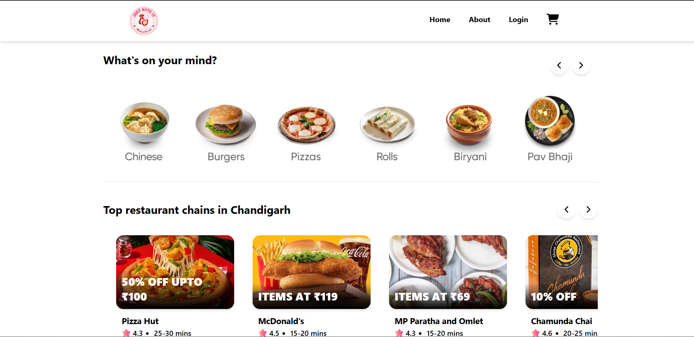
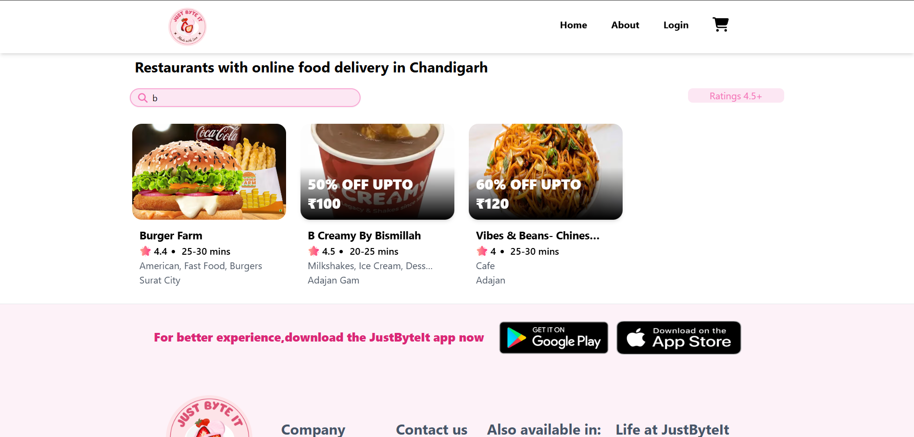

<<<<<<< HEAD
# Just Byte It

JustByteIt is a web application built to explore and learn React.js. This project integrates Swiggy's APIs. The app uses various tools like Tailwind CSS for styling, Redux for state management, React Router for page navigation and Parcel as a bundler among others.

## Tech Stack

- React.js
- Redux
- React Router
- Tailwind CSS
- Parcel (Bundler)
- Babel (Transpiler)

## Key Features

- Integration of APIs for dynamic data fetching.
- Config-driven UI for easy customization.
- State management with Redux for a seamless user experience.
- Code splitting and lazy loading for better performance.
- Custom Hooks for reusable logic.
- Shimmer UI for a smooth loading experience.


## Screenshots from the web application 

### Home Page




### Restaurant Page


### Cart Page


## Features

- **Real-time Search:** Search for products and services in real-time, enhancing the user experience.
- **Cart Management:** Users can manage their shopping cart and proceed to checkout with ease.
- **Lazy Loading:** Optimized resource loading to improve application performance.
- **Testing:** Full test coverage using Jest and React Testing Library to ensure quality.

## Setup

To run this project locally, follow these steps:

1. **Clone the repository:**
    ```bash
    git clone https://github.com/your-username/justbyteit.git
    cd justbyteit
    ```

2. **Install dependencies:**
    ```bash
    npm install
    ```

3. **Start the development server:**
    ```bash
    npm start
    ```

4. **Open the application:**  
    Open your browser and navigate to [http://localhost:1234](http://localhost:1234) to access the application.

---

> Note: JustByteIt is a learning project built for educational purposes. It is not intended for commercial use or public deployment.
